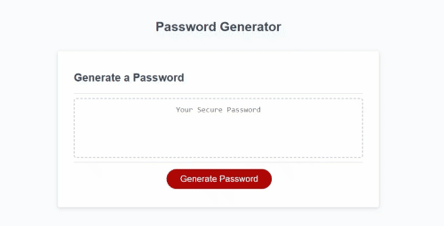

# PassGen- Password Generator

## Description

- This third challenge helped me test my knowledge and understanding of Javascript concepts.

- It also helped me understand how Javascript executes commands to make websites feel more interactive.

- Although not related, it also helped me find the help I needed to finish my assingment in time, which in itself was an invaluable lesson.

## Technical Skills

## Table of Contents (Optional)

- [Access](#access)
- [Visuals](#visuals)
- [Credits](#credits)
- [License](#license)
- [Features](#features)
- [How to Contribute](#how-to-contribute)
- [Tests](#tests)

## Access

- The link to my Github repository: https://github.com/EvolanGIT/passGen-challenge-wk3
- The launched website: https://evolangit.github.io/passGen-challenge-wk3/

## Visuals

This is the screenshot of the full-size website portfolio.
    

    

## Credits

- Sangeetha Kaliaperumal - the gentle AskBCS who patiently helped me debug my code until it was clean and running.
- Melany Pietrowski https://github.com/Melpie10 for all your constructive 
comments and infinite patience when a concept proves difficult to understand.

- The four Codesmen- (myself being one of)
- Edwin Pietrowski https://github.com/BogartDME
- Denart Ifurung https://github.com/difurung
- Charles Beatty https://github.com/beattycharles
- UNCC coding bootcamp TA's for all their insight and help with concepts.

## License

Copyright (c) [2022] [Yonatan Yael Bermudez Diez]

## Features

-The password generator offers four different types of characters to choose from.
-Window alerts pop up when promted and when an impasse or incorrect criteria has been met.

## How to Contribute

Constructive Comments are always welcome. e-mail me: yon_baermund@hotmail.com

## Tests

- choose to not have any type of character in your password.
- type nothing on the input window.
- type the actual number (i.e. eight instead of 8).
